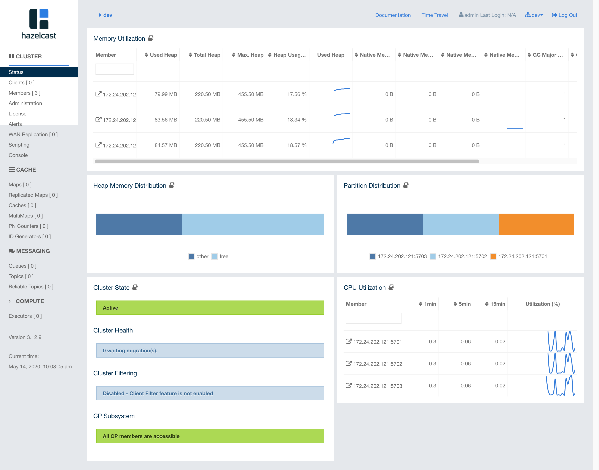
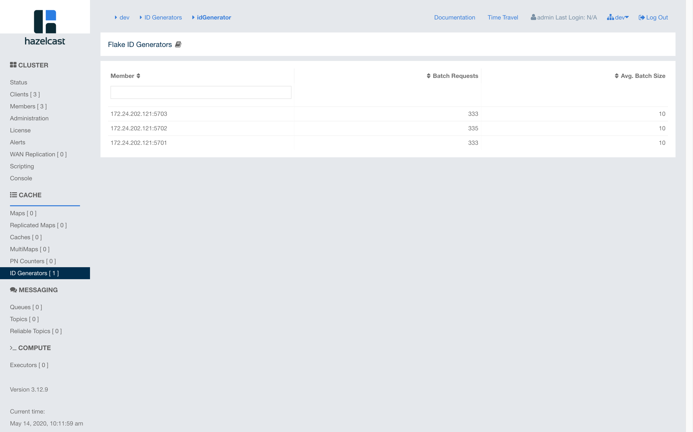
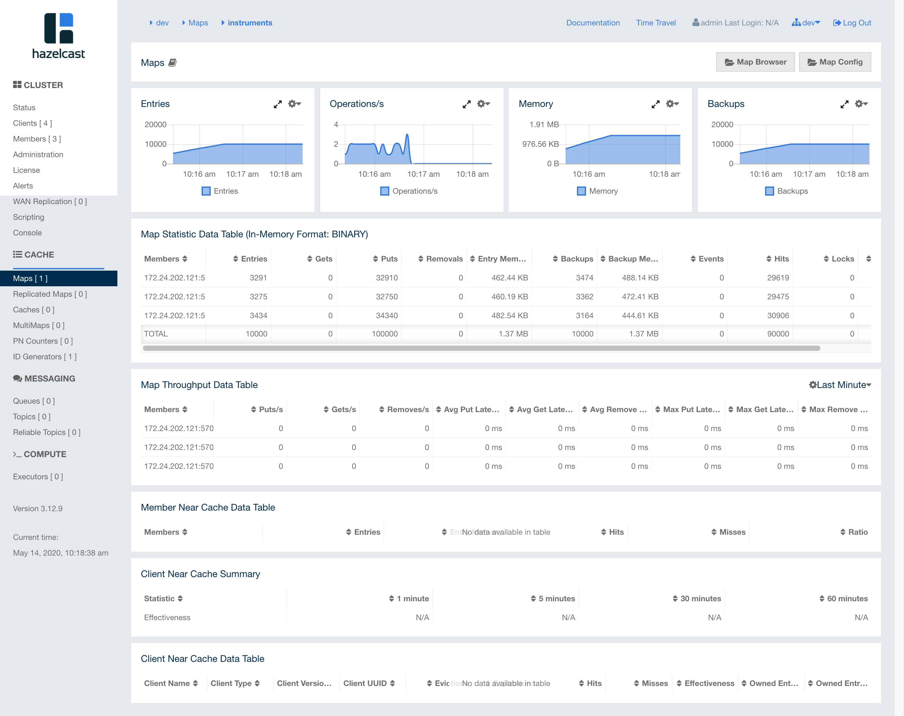

# distributed-lock-examples

史上最全的分布式锁合辑(我们不造轮子，只需用好轮子！)

注：为学习实验方便，示例代码中的zookeeper、redis、jdbc、hazelcast均使用本地嵌入式，实际应用应使用独立部署的服务。

* distributed-hazelcast-lock-example(hazelcast实现分布式锁及分布式id)

修改`docker-compose.yaml`和`hazelcast.xml`中宿主机的IP 地址后执行`docker-compose up -d`即可启动一个三个节点的hazelcast集群。

浏览地址栏访问`http://localhost:8080/hazelcast-mancenter`可访问`hazelcast`的控制台

三台子节点信息

分布式 id

map

* distributed-redis-lock-example(redis 实现分布式锁)

* distributed-zookeeper-lock-example(zookeeper 实现分布式锁)

* spring-integration-distributed-lock-examples(spring-integration 实现分布式锁) 分别使用ZookeeperLockRegistry、RedisLockRegistry、JdbcLockRegistry实现分布式锁

